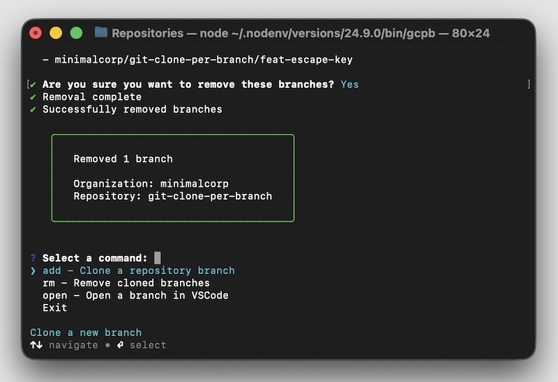

# gcpb

[](https://www.npmjs.com/package/@minimalcorp/gcpb)
[](https://www.npmjs.com/package/@minimalcorp/gcpb)
[](https://github.com/minimalcorp/git-clone-per-branch/actions/workflows/ci.yml)
[](https://github.com/minimalcorp/git-clone-per-branch/actions/workflows/publish.yml)
[](https://opensource.org/licenses/MIT)

**Simpler than git worktree. Works perfectly with dev containers.**

CLI tool for cloning git repositories per branch - a simple, dev container-friendly alternative to git worktree.

<!--  -->



## 📖 Available in Other Languages

- [日本語 (Japanese)](docs/readme/ja.md)

## Why gcpb?

### The Problem with Git Worktree

While `git worktree` is powerful, it comes with significant challenges that gcpb solves:

1. **❌ Broken Dev Container Support** - Worktrees don't work properly with dev containers. VSCode extensions like GitLens fail to recognize worktrees as git repositories inside dev containers ([GitLens Issue #2818](https://github.com/gitkraken/vscode-gitlens/issues/2818))

2. **📚 Steep Learning Curve** - Requires learning worktree-specific commands (`git worktree add`, `git worktree prune`, etc.) instead of familiar git operations

3. **🔧 Manual Configuration** - Upstream branches must be configured manually, adding extra steps to your workflow

4. **🗑️ Maintenance Overhead** - Requires periodic cleanup with `git worktree prune` to remove stale entries

5. **🔗 Hidden Dependencies** - All worktrees share the same `.git` directory, creating invisible connections between seemingly independent directories

6. **⏰ Delayed Tool Support** - Many tools still don't fully support worktrees. VSCode only added complete worktree support in July 2025

### gcpb's Advantages

gcpb uses completely independent clones, which means:

- ✅ **Perfect dev container compatibility** - Every clone is a full git repository
- ✅ **Zero learning curve** - Works like regular `git clone`
- ✅ **Automatic upstream setup** - Branches are configured automatically
- ✅ **Simple cleanup** - Just delete the directory
- ✅ **Complete independence** - Each clone is truly isolated
- ✅ **Universal tool support** - Works with all git tools, immediately

### Comparison Table

| Feature | git worktree | gcpb |
|---------|--------------|------|
| **Learning Curve** | Learn worktree-specific commands | Use familiar git operations |
| **Dev Container Support** | ❌ Broken (GitLens, extensions fail) | ✅ Perfect compatibility |
| **Maintenance** | Manual `git worktree prune` required | Simple directory deletion |
| **Directory Structure** | Dependent on main repository | Fully independent clones |
| **Tool Compatibility** | Partial support, slowly improving | Works with all git tools |
| **User Experience** | Special commands (`git worktree add`) | Interactive CLI with fuzzy search |
| **Upstream Configuration** | Manual setup required | Automatic configuration |
| **Beginner Friendly** | ⚠️ Intermediate users recommended | ✅ Perfect for beginners |

### Who Benefits Most?

- 🐳 **Dev container users** - gcpb works flawlessly where worktree fails
- 🆕 **Git beginners/intermediates** - No special commands to learn
- 🔄 **Parallel feature developers** - Easily work on multiple branches simultaneously
- 👀 **Code reviewers** - Quickly clone and test PRs without affecting your main work

## Quick Start

Get started in 3 simple steps:

```bash
# 1. Install
npm install -g @minimalcorp/gcpb

# 2. Initialize workspace
cd ~/workspace
gcpb init

# 3. Clone a branch (interactive mode)
gcpb
```

That's it! Select "add" from the menu, and gcpb will guide you through cloning a repository branch.

<!--  -->

## Features

- **Interactive command selection** - Searchable command menu with fuzzy filtering
- **Smart URL detection** - Automatically detects repository URLs from existing branches
- **Organized structure** - Clone repositories into `${owner}/${repo}/${branch}`
- **Multiple commands** - Add, remove, open, and manage cloned branches
- **Auto-open in VSCode** - Instantly open cloned repositories in your editor
- **Context-aware prompts** - Simplified input based on current directory
- **Support for HTTPS and SSH** - Works with both authentication methods
- **Type-safe** - Built with TypeScript for reliability

## Installation & Setup

### Global Installation (npm)

```bash
npm install -g @minimalcorp/gcpb
```

### First Time Setup

Initialize gcpb in your desired workspace directory:

```bash
cd ~/workspace  # or your preferred location
gcpb init
```

This creates a `.gcpb` directory to store configuration.

> **💡 Recommended**: Initialize gcpb in an **empty directory**. Starting with a clean workspace ensures proper directory structure and avoids conflicts with existing files.

### Local Development

```bash
# Clone this repository
git clone https://github.com/minimalcorp/gcpb.git
cd gcpb

# Install dependencies
npm install

# Build the project
npm run build

# Link locally for testing
npm link
```

## Usage Guide

### Interactive Mode

Simply run `gcpb` to enter interactive mode:

```bash
gcpb
```

You'll see a searchable command menu:
- `add` - Clone a new repository branch
- `rm` - Remove cloned branches
- `open` - Reopen a branch in VSCode
- `Exit` - Exit the program

Type to filter commands, then select with Enter or arrow keys.

### Commands

#### Add a Repository Branch

```bash
gcpb add
```

The CLI will guide you through:

1. **Repository URL** (auto-detected if in owner/repo directory)
   - Example: `https://github.com/user/repo.git`
   - Example: `git@github.com:user/repo.git`

2. **Remote branch name**: The remote branch to checkout from
   - Default: `main`

3. **Local branch name**: Your local working branch
   - Example: `feat/new-feature`

4. **Confirmation**: Review the target directory

Repositories are cloned to: `.gcpb/${owner}/${repo}/${local-branch}/`

#### Remove Branches

```bash
gcpb rm
```

Select branches to remove from an interactive list.

#### Reopen in VSCode

```bash
gcpb open
```

Select a previously cloned branch to reopen in VSCode.

### Example

```bash
# Initialize workspace
$ cd ~/workspace
$ gcpb init
✔ Initialized .gcpb in /Users/you/workspace

# Enter interactive mode
$ gcpb
? Select a command: › add - Clone a repository branch

# Smart URL detection (when in .gcpb/facebook/react directory)
$ cd .gcpb/facebook/react
$ gcpb add
Detected context: facebook/react
Found repository URL from "main" branch:
  https://github.com/facebook/react.git

? Use this repository URL? Yes
? Enter the remote branch name: main
? Enter the local branch name: feat/new-hooks

Repository will be cloned to:
  /Users/you/workspace/.gcpb/facebook/react/feat-new-hooks

? Continue? Yes
✔ Prerequisites OK
✔ Repository cloned successfully
✔ Successfully opened in VSCode

╭────────────────────────────────────────────────────────────╮
│                                                            │
│   Repository cloned to:                                   │
│   /Users/you/workspace/.gcpb/facebook/react/feat-new-hooks│
│                                                            │
│   Branch: feat/new-hooks                                  │
│                                                            │
╰────────────────────────────────────────────────────────────╯
```

## Use Cases

### 1. Feature Development Workflow

Working on multiple features simultaneously without conflicts:

```bash
# Start working on feature A
gcpb add
# Clone main branch → feat/authentication

# Start feature B without switching
gcpb add
# Clone main branch → feat/payment-integration

# Both features have independent environments
# - Separate dependencies (node_modules)
# - Separate git history
# - Separate dev containers if needed
```

**Benefits**: No branch switching, no stashing, no conflicts between features.

### 2. Review & QA Environment

Quickly test pull requests without disrupting your work:

```bash
# Reviewer wants to test PR #123
gcpb add
# Clone pr/new-api-endpoint → review/pr-123

# Test the changes
cd .gcpb/owner/repo/review-pr-123
npm install
npm test

# Done? Just delete it
gcpb rm
# Select: review/pr-123
```

**Benefits**: Test PRs in isolation, maintain your main development flow.

### 3. Dev Container Development (Key Use Case)

**This is where gcpb truly shines.** Git worktree breaks with dev containers, but gcpb works perfectly:

```bash
# Clone a branch for dev container work
gcpb add
# Clone main → feat/api-redesign

# Open in VSCode with dev container
cd .gcpb/owner/repo/feat-api-redesign
code .

# Open folder in Container (VSCode command)
# ✅ GitLens works
# ✅ Git extensions work
# ✅ All git operations work normally
```

**Why it works**: Each gcpb clone is a complete, independent git repository. Dev containers see the full `.git` directory, so all tools function normally.

**What breaks with git worktree**: Dev containers can't find the shared `.git` directory, causing:
- GitLens to fail
- Git history to be unavailable
- Extensions to malfunction
- Poor developer experience

<!--  -->

**Reference**: See [GitLens Issue #2818](https://github.com/gitkraken/vscode-gitlens/issues/2818) for detailed discussion of the worktree + dev container problem.

### 4. Parallel Version Development

Working on different versions or long-running branches:

```bash
# Maintain v1.x while developing v2.x
gcpb add
# Clone release/v1.x → hotfix/security-patch

gcpb add
# Clone main → feat/v2-rewrite

# Work on both versions independently
# Each has its own dependencies and build artifacts
```

**Benefits**: No dependency conflicts, clear separation of concerns.

## How it Works

### Interactive Mode
- Searchable command selection with fuzzy filtering
- Context-aware commands (init-only before setup, full commands after)
- Graceful exit with Ctrl+C

### Smart URL Detection
1. Detects current directory location in gcpb structure
2. If in owner/repo directory, lists available repositories
3. Extracts remote URL from existing branch `.git` directories
4. Falls back to manual URL input if detection fails

### Cloning Process
1. Parses the Git URL to extract owner/organization and repository name
2. Creates the directory structure: `.gcpb/${owner}/${repo}/${branch}`
3. Clones the repository to the target directory
4. Creates and checks out a local branch based on the specified remote branch
   - Equivalent to: `git checkout -b ${localBranch} origin/${remoteBranch}`
5. Opens the directory in VSCode (if available)

## Requirements

- Node.js >= 20.12.0 (Active LTS versions 20, 22, or 24 recommended)
- Git installed and available in PATH
- VSCode (optional, for auto-open feature)

### Supported Node.js Versions

This package supports the following Node.js versions:
- **Node.js 20.x**: >= 20.12.0 (Maintenance LTS until April 2026)
- **Node.js 22.x**: Latest (Maintenance LTS until April 2027)
- **Node.js 24.x**: Latest (Active LTS until April 2028)

We recommend using the latest Active LTS version (Node.js 24) for the best experience.

## Configuration

The tool will:
- Check for Git installation before proceeding
- Validate URLs and branch names
- Prevent overwriting existing directories
- Handle authentication errors gracefully

## FAQ

### Q: What's the main difference between gcpb and git worktree?

**A**: The core difference is independence vs. sharing. Git worktree creates linked directories that share a single `.git` repository, while gcpb creates completely independent clones. This makes gcpb:
- ✅ Compatible with dev containers (worktree is not)
- ✅ Simpler to understand and use
- ✅ Compatible with all git tools immediately
- ⚠️ Uses more disk space (but less than you might think - see below)

### Q: Doesn't gcpb use a lot more disk space?

**A**: While gcpb does use more disk space than worktree, the difference is often negligible:

- **Git objects are compressed**: The `.git` directory is usually much smaller than your `node_modules` or build artifacts
- **Modern SSDs are cheap**: A few hundred MB per clone is rarely a concern with today's storage
- **Selective cloning**: You only clone the branches you're actively working on
- **Easy cleanup**: Remove clones you don't need with `gcpb rm`

**Example**: A typical Next.js project might be:
- `.git` directory: ~50MB
- `node_modules`: ~500MB
- Build artifacts: ~200MB

The repository itself is only 7% of total disk usage. Having 5 independent clones uses ~250MB for git vs ~3.5GB total.

### Q: Can I migrate from git worktree to gcpb?

**A**: Yes! Here's how:

1. **List your current worktrees**: `git worktree list`
2. **For each worktree**, note the branch name
3. **Use gcpb to clone each branch**: `gcpb add` for each branch
4. **Remove old worktrees**: `git worktree remove <path>`
5. **Clean up**: `git worktree prune`

You can migrate gradually - gcpb and worktree can coexist during transition.

### Q: Does gcpb work with monorepos?

**A**: Yes! gcpb works perfectly with monorepos. Each clone is a complete repository, so all monorepo tools (Nx, Turborepo, Lerna) work normally. You can:
- Run different branches of the monorepo simultaneously
- Test changes across different branches
- Use dev containers with monorepos (which is problematic with worktree)

### Q: Does gcpb work on Windows/Mac/Linux?

**A**: Yes, gcpb is cross-platform and works on:
- ✅ **macOS** (Intel and Apple Silicon)
- ✅ **Linux** (all distributions)
- ✅ **Windows** (Windows 10/11, WSL2)

Requirements:
- Node.js 18+ (cross-platform)
- Git (cross-platform)
- VSCode (optional, cross-platform)

### Q: Can I use gcpb without VSCode?

**A**: Absolutely! The auto-open feature is optional. gcpb works perfectly from the command line. Simply:
- Use `gcpb add` to clone branches
- Navigate with `cd .gcpb/owner/repo/branch`
- Use your preferred editor (vim, emacs, IntelliJ, etc.)

The `gcpb open` command only works if you have VSCode installed, but all other features work with any editor.

## Development

### Development Environment

This project uses Node.js 24.12.0 for development. The version is pinned via:
- `.node-version` file (for nvm, fnm, nodenv, asdf)
- Docker dev container (`.devcontainer/Dockerfile`)

To ensure you're using the correct version:

```bash
# With nvm
nvm use

# With fnm
fnm use

# Or check manually
node --version  # Should output v24.12.0
```

### Development Commands

```bash
# Install dependencies
npm install

# Build the project
npm run build

# Run in development mode (watch)
npm run dev

# Run linter
npm run lint

# Fix linting issues
npm run lint:fix

# Format code
npm run format

# Check formatting
npm run format:check

# Run tests
npm test
```

## Contributing

Contributions are welcome! Please feel free to submit a Pull Request.

For major changes, please open an issue first to discuss what you would like to change.

## License

MIT
